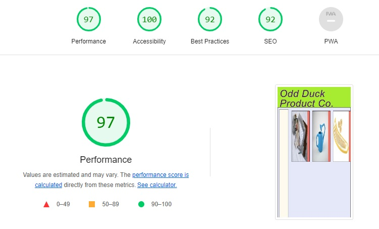

# odd-duck

## Author: Laurel Perkins

## References

* I used <https://developer.mozilla.org/en-US/docs/Web/CSS/gradient/radial-gradient> to learn how to use radial-gradient background style in CSS.

## Lighthouse Accessibility Scores

* 